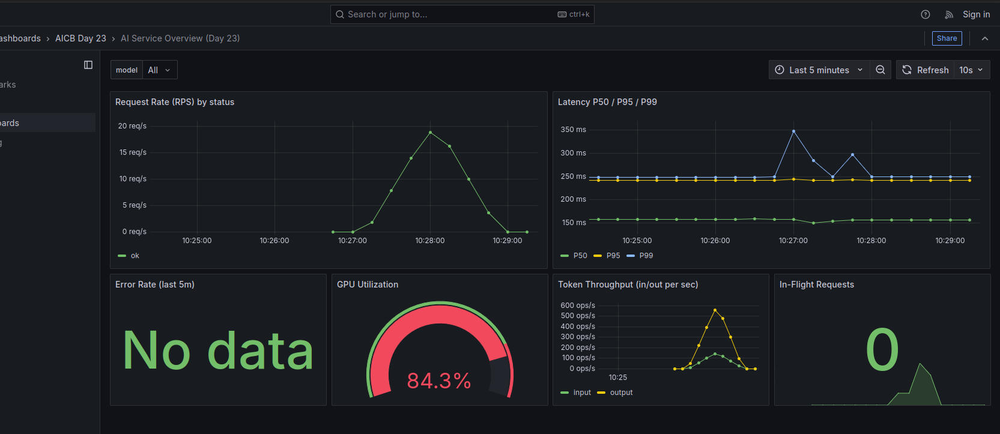
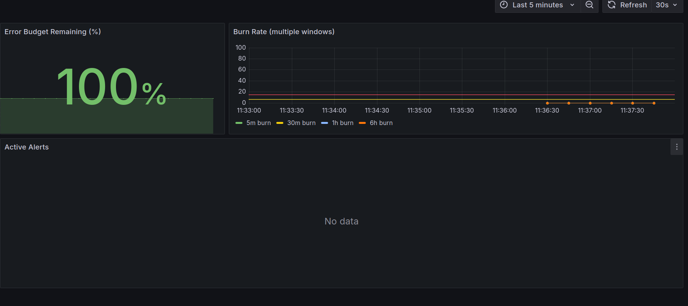
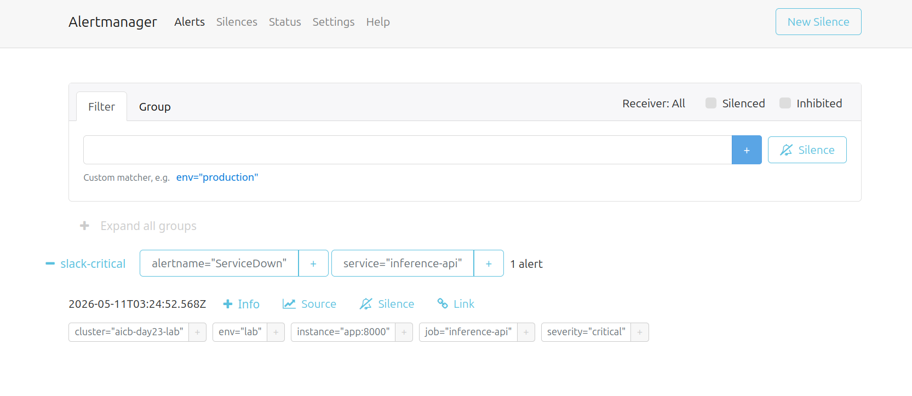
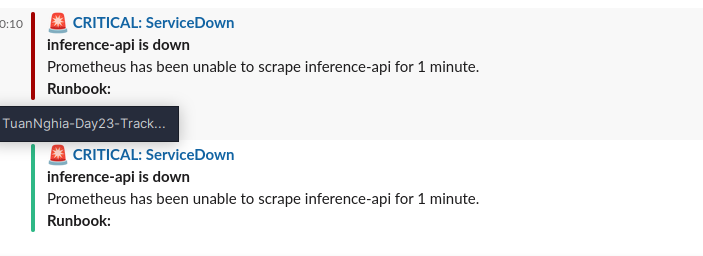
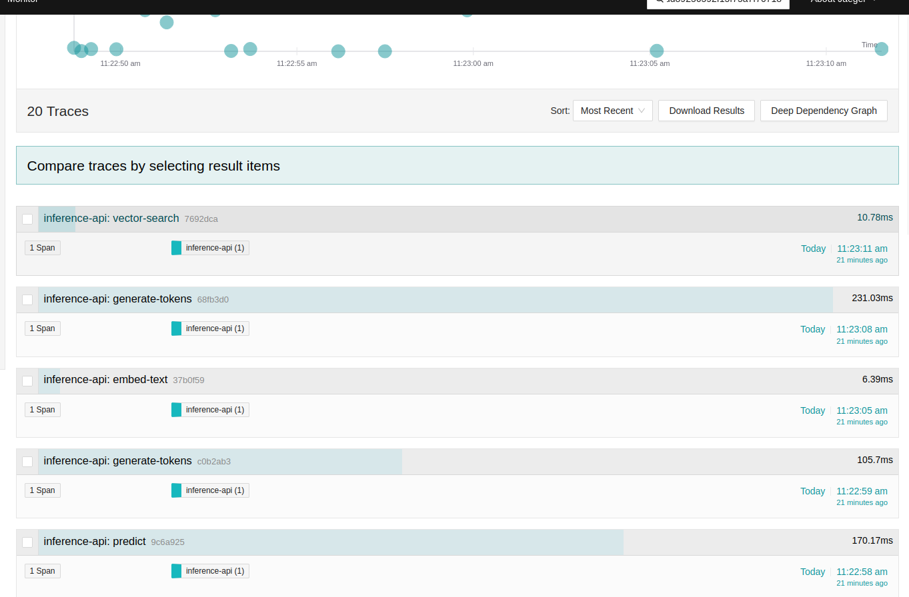

# Day 23 Lab Reflection

> Fill in each section. Grader reads the "What I'd change" paragraph closest.

**Student:** _your name_
**Submission date:** _YYYY-MM-DD_
**Lab repo URL:** _public GitHub URL_

---

## 1. Hardware + setup output

Paste output of `python3 00-setup/verify-docker.py`:

```
Docker:        OK  (28.5.2)
Compose v2:    OK  (2.40.3-desktop.1)
RAM available: 7.75 GB (OK)
Ports free:    BOUND: [8000, 9090, 9093, 3000, 3100, 16686, 4317, 4318, 8888]
Report written: /home/nghia/PycharmProjects/TuanNghia-Day23-Track2-Observability-Lab/00-setup/setup-report.json
```

---

## 2. Track 02 — Dashboards & Alerts

### 6 essential panels (screenshot)



### Burn-rate panel



### Alert fire + resolve

| When | What | Evidence |
|---|---|---|
| _T0_ | killed `day23-app`         |  |
| _T0+90s_ | `ServiceDown` fired   |  |
| _T1_ | restored app              | — |
| _T1+60s_ | alert resolved        |  |

### One thing surprised me about Prometheus / Grafana

The surprising part was how easy it is for a dashboard to show `No data` even when the stack is healthy. In my case, missing series such as `status="error"` and a mismatched Grafana datasource UID made panels look broken, even though Prometheus and Grafana were both running. It made me treat dashboard queries and labels as part of the product, not just decoration on top of metrics.

---

## 3. Track 03 — Tracing & Logs

### One trace screenshot from Jaeger



### Log line correlated to trace

Paste the log line and the trace_id it links to:

```
{"level":"info","model":"llama3-mock","input_tokens":8,"output_tokens":8,"quality":0.855,"duration_seconds":0.1657,"trace_id":"57006575a9186dd448ababc625612023","event":"prediction served","timestamp":"2026-05-
  11T04:23:13Z"}
```

### Tail-sampling math

If your service produced N traces/sec, what fraction did the policy keep? Show the calculation.

The policy keeps 100% of error traces, 100% of slow traces over 2 seconds, and 1% of normal healthy traces. If the service produces N traces/sec and they are all healthy and under 2 seconds, the collector keeps `0.01 * N` traces/sec. If `E` traces/sec are errors and `S` traces/sec are slow, the kept rate is approximately `E + S + 0.01 * (N - E - S)`, assuming the groups do not overlap.

---

## 4. Track 04 — Drift Detection

### PSI scores

Paste `04-drift-detection/reports/drift-summary.json`:

```json
{
  "prompt_length": {
    "psi": 3.461,
    "kl": 1.7982,
    "ks_stat": 0.702,
    "ks_pvalue": 0.0,
    "drift": "yes"
  },
  "embedding_norm": {
    "psi": 0.0187,
    "kl": 0.0324,
    "ks_stat": 0.052,
    "ks_pvalue": 0.133853,
    "drift": "no"
  },
  "response_length": {
    "psi": 0.0162,
    "kl": 0.0178,
    "ks_stat": 0.056,
    "ks_pvalue": 0.086899,
    "drift": "no"
  },
  "response_quality": {
    "psi": 8.8486,
    "kl": 13.5011,
    "ks_stat": 0.941,
    "ks_pvalue": 0.0,
    "drift": "yes"
  }
}
```

### Which test fits which feature?

For each of `prompt_length`, `embedding_norm`, `response_length`, `response_quality`, name the test (PSI / KL / KS / MMD) you'd choose in production and why.

For `prompt_length`, I would use PSI because it is a stable production-friendly way to detect distribution shifts in a numeric feature and explain whether traffic has moved into different length buckets. For `embedding_norm`, I would use KS because this is a continuous numeric feature where a non-parametric comparison of the reference and current distributions is useful even when the shift is subtle.

For `response_length`, I would also use PSI because response length is easy to bucket and monitor over time as a practical operational signal. For `response_quality`, I would use KS or KL depending on the reporting need: KS is easier to interpret as a distribution shift test, while KL is useful when I want to quantify how much the current quality-score distribution diverges from the baseline.

---

## 5. Track 05 — Cross-Day Integration

### Which prior-day metric was hardest to expose? Why?

The hardest prior-day metric to expose would be a real vector-store metric from Day 19, because it depends on a separate service being reachable and exposing metrics in a Prometheus-compatible format. The stub is straightforward, but a real integration needs stable target configuration, networking from the Compose stack to the host or service, and labels that make sense when combined with the Day 23 dashboard.

---

## 6. The single change that mattered most

> **Grader reads this closest.** What one thing about your stack design — a metric you added, a label you dropped, a panel you reorganized, an alert threshold you tuned — made the biggest difference between "works" and "useful"? Write 1-2 paragraphs. Connect it to a concept from the deck.

The single change that mattered most was making the AI-specific metrics first-class: `inference_tokens_total` and `inference_quality_score` sit next to normal RED metrics instead of being treated as separate application details. Request rate, errors, and latency explain whether the API is technically healthy, but tokens and quality explain whether the AI service is still useful and cost-aware. That connects directly to the fourth-pillar idea from the deck: AI systems need observability for model behavior and cost, not only infrastructure health.

The other practical lesson was label discipline. Keeping labels like `model`, `status`, and `direction` gave the dashboards enough dimensions to answer real questions without creating uncontrolled cardinality. Once the labels were stable, Grafana panels, SLO burn-rate rules, and alert routing became much easier to reason about because every query was built from the same metric contract.
